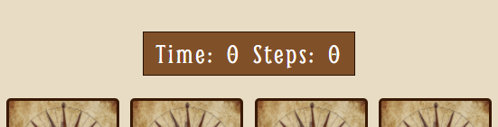
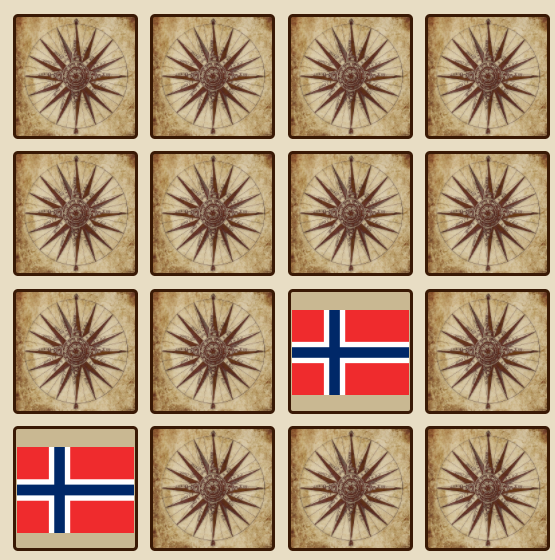
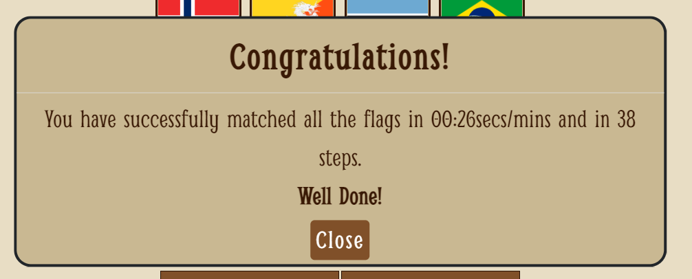
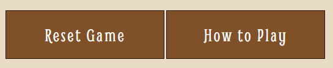
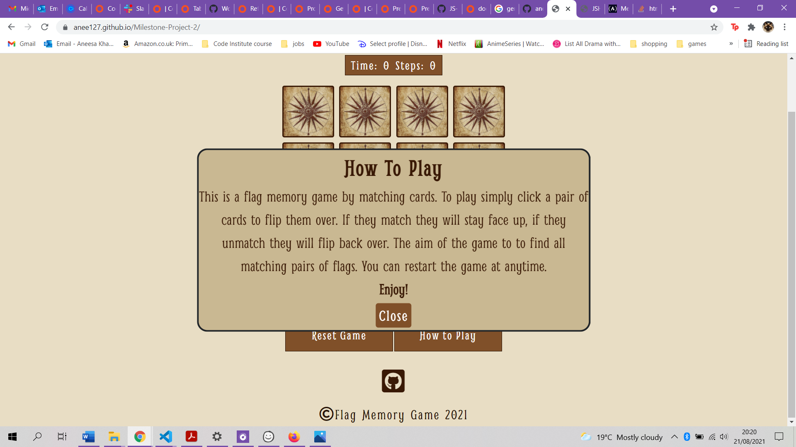
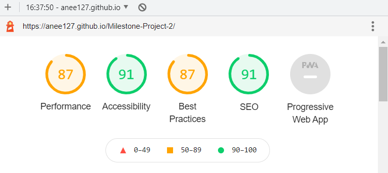
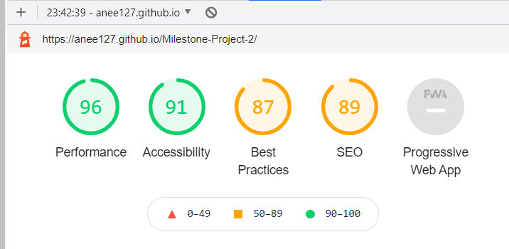

# Flag Memory Game

**Live Page**: https://anee127.github.io/Milestone-Project-2/

**This game is part of the second Milestone Project carried out through the Code Institute.**

This webpage was created to launch a simple memory card game that people of all ages can play. The purpose it to match pairs of cards together with the same country’s flag design. The website itself is an example of my skills in HTML, CSS and JavaScript. There is a link to the GitHub repository, in the footer, for users who wish to see the code behind the webpage.

## <u>Table of Contents</u>
- [**User Experience (UX)**](#user-experience-ux)
+ [Purpose](#purpose)
+ [User Stories](#user-stories)
+ [Design](#design)
+ [Wireframes](#wireframes)

- [**Features**](#features)
+ [Existing Features](#exsiting-features)
+ [Features left to Include](#features-left-to-include)

- [**Technologies**](#technologies)
+ [Languages](#languages)
+ [Frameworks, Libraries and Programs](#frameworks-libraries-and-programs)

- [**Deployment**](#deployment)
+ [Deploy to Github](#deploy-to-github)

- [**Testing**](#testing)
+ [Testing User Stories](#testing-user-stories)
+ [Testing Usability of Webpage](#testing-usability-of-webpage)
+ [Validator Checks](#validator-checks)
+ [Additional Testing](#additional-testing)
+ [Bugs](#bugs) 

- [**Credits**](#credits)
+ [Content](#content)
+ [Media](#media)
+ [Acknowledgements](#acknowledgements) 
- [**Contact**](#contact)

## **User Experience (UX)**
### Purpose
The second milestone project idea is to create a memory game webpage for users of all ages to play. With the use of flag images to help users learn the different patterns and colours of flags.
### User Stories

**As a user I want to:**
1.	easily navigate through a well-designed game through the webpage.
2.	Have access to game rules that are easy to understand.
3.	Test my memory skills and check the time and number of turns taken to match all cards.
4.	Be able to see my score results after completing the game. 
5.	Have the chance to play again.
6.	use the website on any device without problem. 
### Design

1. **Structure**
-	I opted for a simple webpage design structure with a single title and footer, pop-up modal windows and relevant images for the front face and back face of the cards. I opted for a historical style colour scheme to make the flags stand out more.  

2. **Colour Scheme**
-	A neutral, washed-out colour scheme in contrast to both dark and light text accordingly to make the buttons and scoring stand out. 
-	The key colours being white, beige, brown and black.
-	The colours used will tie in with the colours of the back image of cards to keep the scheme throughout the website.

Source: [Coolors]( https://coolors.co/65361f-391905-805029-c9b892-e8ddc4-ffffff)

3. **Typography**
The Smythe font is used throughout the webpage, a font that suits the overall historical theme of the webpage. Bold, coloured text is used for emphasis on the heading and for buttons. Sans-serif is the backup font in case the original font does not load onto the website.

4. **Images**
-	A relevant image was used for the back-face of the cards. An old compass drawing on washed-out paper.
-	The flag images used an API to render them onto the card faces of the game.
5. **Wireframes**
At the start of the project, I designed the wireframes using Balsamiq. These initial designs made it easier to plan the overall design and structure of the webpage. Some elements of the final webpage are different from these original wireframes.
[Wireframes link](assets/pdf/ms2-wireframes.pdf)
## **Features**
### Existing Features

1. **Game Score Area**
-	The game score area records the time taken and steps taken while flipping over the cards. The time starts as soon as the user clicks a card. The number of steps is recorded at each click. 

2. **Memory Game Grid Area**
-	The game area where the matching of cards takes place. There are 16 cards within the grid each showing the compass back-face image, until the user clicks on a card to show a flag image. There are 8 pairs of flags in a random order to match. 
-	When all cards have been matched a modal window will pop-up to congratulate the user completing the game, displaying their score. 

3. **Game Buttons Area**
-	The restart button is there to refresh the grid area, the timer and the number of steps, as well as reshuffling the cards. 
-	The how to play button shows a modal pop-up where a message is shown to the user containing information on game instructions. As well as a close button to remove the modal. 

4. **Footer**
-	There is an icon that has a link to GitHub, when clicked it will open a new tab to show the code for the webpage including the JavaScript code.
### Features Left to Include

**Future Features**
-	To allow users to have a choice between multiple difficulty levels where the number of cards increase. 
-	To save game results on a scoreboard so users can compare their own scores to themselves or other users. 
-	To create a flip animation where cards are flipped in a more fun way, to make it more pleasing for users.  
-	To use a larger range of flag images for a more random array. 
## Technologies Used
### Languages
-	[HTML5](https://en.wikipedia.org/wiki/HTML5)
-	[CSS3](https://en.wikipedia.org/wiki/CSS)
-	[JavaScript](https://en.wikipedia.org/wiki/JavaScript)
### Frameworks, Libraries and Programmes
-	[Bootstrap 5.1](https://getbootstrap.com/)
-	[FontAwesome 5.15.2](https://fontawesome.com/v5.15/)
-	[GitHub](https://github.com/)
-	[Git](https://git-scm.com/)
-	[Visual Studio Code](https://code.visualstudio.com/)
-	[Balsamiq](https://balsamiq.com/)
-	[Google Fonts](https://fonts.google.com/)
-	[Coolors](https://coolors.co/)
- [JQuery](https://jquery.com/)
- [HTML Formatter](https://validator.w3.org/)
- [CSS Formatter](https://jigsaw.w3.org/css-validator/)
- [JShint](https://jshint.com/)
- [Webformatter](https://webformatter.com/)

# Deployment
### Deploy To Github
1.	Login to GitHub and find the GitHub repository.
2.	Click the settings button at the top of the repository menu.
3.	Locate "Pages" on the settings page which will be at the bottom of the menu.
4.	Under the subheading "Source" there will be a dropdown menu stating "None", select "Main or Master Branch" and save.
5.	The page will refresh automatically.
6.	The link to the published site will appear at the top of the page.
# Testing
### Testing User Stories
- Upon entering the site, users are automatically greeted with the memory game page.
- The layout is simple and neutral to allow the colourful flag designs to stand out.
-  The heading is large and readable and contrasts well with the background colour. 
- All images have a good enough resolution and do not appear blurry. 
- The game buttons are highlighted when clicked.
- The rules pop-up window is easy to access, read and understand. 
- The games timer and steps are readable and remain between the heading and the game grid. 
- The matching of cards is simple and fun for users, it tests their memory skills.
- There is a pop-up window after game is completed with users results so that they can play again to beat their score.

### Testing Usability of Webpage
- This site is primarily for computers but uses Bootstrap to make the layout easier to design and accessible on iPads and phones by using media queries in the style.css file.
- Viewport tag included in the head of HTML files to tell the browser how to respond to different resolutions, particularly mobile ones.
### Validator Checks

The W3C Markup Validator and W3C CSS Validator Services were used to validate every page of the project to ensure there were no syntax errors in the project. Code was entered through direct input. Chrome Lighthouse tool was used to check the performance of the webpage. JShint JavaScript code checker was used to find errors in JavaScript code.

- [**HTML Validator**](https://validator.w3.org/nu/#textarea)
 No warning Message or Errors received.

- [**CSS Validator**](https://jigsaw.w3.org/css-validator/#validate_by_input)
 No errors or warning messages were received for my CSS code several warnings occurred for the third party links used in my code.

- [**JShint**](https://jshint.com/) 
The only issues found through the JShint report were the use of 'const', ‘let, and 'arrow-function' variable, which is only available in ES6, but were not major errors.
[JShint report](assets/images/jshint-report.png) 

- [**Chrome Lighthouse tool**](https://developers.google.com/web/tools/lighthouse)
Chrome Lighthouse test on mobile device

Chrome Lighthouse test on desktop device

### Additional Testing
- The Website was tested on Google Chrome, Internet Explorer and Safari browsers.
- The website was viewed on a variety of devices including desktops, Laptops, Mobile phones, iPads and iPhones.
- Friends and family members were asked to review the site to point out any bugs, user experience issues and/or suggestions.
- Project posted on Slack, asking for feedback from fellow students.
  - Feedback action:
   + All button functions were tested and working fine, modal pop-ups appeared when needed and came cards flipped when clicked. 
    + There were still a few styling and function errors for the flag images, only on iPhone devices so these were checked. 
### Bugs
- The webpage did not come out responsive on devices smaller than 480px wide. Changes were made to media queries to target the size of text, images, buttons and game cards to make them smaller but still readable on smaller devices.
- Responsiveness on iPhones was a problem. flag images shifted downwards and out of cards when clicked. This was addressed by changing the width of the flag images in the api url in the JavaScript file as well as changing the styling in media queries.
- When modal windows are shown on device, the webpage underneath is responsive as cards will still flip over once clicked. Due to loss of time, this was not fixed. A new div wrapping the modal windows had to be made and applied to the JavaScript file for it to function. However, a lot of work was still needed in order to fix this. It is not a major flaw if the user does not click in the background when modals are open.
- Previously, there was a bug in the code where the matched cards would flip back over when clicked as well as the End Game modal message appearing when not all cards had been matched. This has been fixed by removing the event listeners for the cards separately instead of disabling the cards. 
# Credits
### Content
Bootstrap 5.1: Bootstrap Library used throughout the project, components used include the grid System, media queries, modals and buttons.
- Some JavaScript code was taken from [CodeInstitute.net](https://codeinstitute.net/), [W3schools.com](https://www.w3schools.com/), [StackOverflow.com](https://stackoverflow.com/) and [dev.to](https://dev.to/).
- Some CSS styling code was taken from [W3schools.com](https://www.w3schools.com/).
### Media
- The card back-face image was taken from [Pixabay.com](https://www.pixabay.com).
- The flag image API was taken from [Flagpedia.net](https://flagpedia.net/download/api).
- Footer icons were taken from [FontAwesome.com]( https://fontawesome.com/).
# Acknowledgements
- My Mentor for continuous help and support throughout the project.
 - The [Code Institute](https://codeinstitute.net/) Slack Community.
- A friend who has given me continuous help and advice throughout the project.
# Contact
Created by @aneesakhan
Contact: Aneesa.khan97@gmail.com